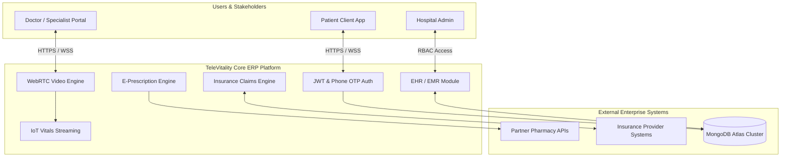

# TeleVitality - Enterprise Telemedicine & Healthcare ERP System Requirements Specification (SRS)


> **"Empowering Health Beyond Boundaries"**  
> An enterprise-grade Software Requirements Specification (SRS), System Architecture Blueprint, Financial Feasibility Model, and UI/UX Framework for a unified Telemedicine and Healthcare Resource Management System.

---

## 🌐 Live Web Portal & PDF Reader

> 🚀 **Experience the Live Web Application**:  
> **[👉 Open Live TeleVitality Systems Architecture & PDF Reader Web App](https://nsarkar-xlr8.github.io/SRS_Doc/)**  
> *(Includes live embedded 63-page PDF reader, page shortcuts, GSAP/Lenis smooth scrolling, interactive 12 Mermaid UML diagrams, and recruiter pitch)*

- 📄 **[View Native PDF In-Browser on GitHub](https://github.com/Nsarkar-XLR8/SRS_Doc/blob/main/SRS_Doc.pdf)**
- 📥 **[Download Original SRS_Doc.pdf (1.2 MB)](SRS_Doc.pdf)**

---

## 📚 Document & Portfolio Navigation

- 🌐 **[Live Web Reader App (GitHub Pages)](https://nsarkar-xlr8.github.io/SRS_Doc/)**: Interactive web application featuring live PDF viewing, Lenis smooth scrolling, GSAP animations, and Mermaid diagram swapper.
- 🧭 **[Master Navigation Index](file:///home/nayem/Personal/SRS/SRS_Doc/INDEX.md)**: Detailed chapter breakdown of the complete 63-page SRS specification.
- 🎯 **[Recruiter & Career Showcase Guide](file:///home/nayem/Personal/SRS/SRS_Doc/CAREER_SHOWCASE_GUIDE.md)**: Resume bullet points, interview talking points, and LinkedIn templates.
- 📁 **[Structured Technical Documentation Directory (`/docs`)](file:///home/nayem/Personal/SRS/SRS_Doc/docs/)**:
  1. [01. Executive Summary & Vision](file:///home/nayem/Personal/SRS/SRS_Doc/docs/01_Executive_Summary_and_Vision.md)
  2. [02. Feasibility & Market Analysis](file:///home/nayem/Personal/SRS/SRS_Doc/docs/02_Feasibility_and_Market_Analysis.md)
  3. [03. Requirements Specification (FRs & NFRs)](file:///home/nayem/Personal/SRS/SRS_Doc/docs/03_Software_Requirements_Specification.md)
  4. [04. System Architecture & 12 UML Diagrams](file:///home/nayem/Personal/SRS/SRS_Doc/docs/04_System_Architecture_and_UML.md)
  5. [05. UI/UX Design System & Principles](file:///home/nayem/Personal/SRS/SRS_Doc/docs/05_UI_UX_Design_System.md)
  6. [06. Tech Stack & Implementation Roadmap](file:///home/nayem/Personal/SRS/SRS_Doc/docs/06_Tech_Stack_and_Deployment_Roadmap.md)

---

## 🌟 System Overview & Business Vision

**TeleVitality** is an all-in-one telemedicine healthcare platform designed to bridge the gap between patients, medical specialists, healthcare providers, and insurance companies. By digitizing the end-to-end clinical workflow, TeleVitality eliminates geographical barriers, reduces wait times, prevents prescription errors, and unifies electronic medical records into a secure cloud ecosystem.

### Core Problems Solved
- ❌ **Preventable Medical Errors**: Paper prescriptions cause dosage and drug conflict mistakes; solved via **99%-accurate E-Prescriptions**.
- ❌ **High Amenable Mortality**: Rural patients lack specialist access; solved via **Sub-3s Video Consultations**.
- ❌ **Opaque Costs & Insurance Delays**: Claims take weeks; solved via **Real-time 48-hour Insurance Processing**.
- ❌ **Fragmented Records**: Patient histories are lost across clinics; solved via **Centralized EHR/EMR Records**.

---

## 🏗️ High-Level System Architecture



---

## 💼 Enterprise ERP Modules & Functional Highlights

### 1. 📹 Virtual Consultation Subsystem
- **Real-Time Video Streaming**: WebRTC peer connections with sub-3-second handshake latency.
- **Concurrency SLA**: Designed to support 100+ simultaneous active sessions per server node.

### 2. 📋 Digital Health Records (EHR / EMR)
- **Fast Record Retrieval**: Fetch patient medical histories and lab diagnostics in **< 2 seconds**.
- **Data Integrity Bounds**: Strict Mongoose schemas enforcing **< 0.1% record error rates**.

### 3. 💊 E-Prescription & Pharmacy Integration
- **Medication Accuracy**: 99% accuracy rule via standardized drug catalog validation.
- **Automated Delivery**: Direct API transmission to partner pharmacy networks.

### 4. ⌚ Remote Patient Vital Monitoring
- **IoT Vitals Streaming**: Real-time streaming of heart rate, oxygen saturation, and blood pressure sensors.
- **Cross-Device Compatibility**: Ingests data from smartwatches and Bluetooth vitals monitors.

### 5. 🛡️ Insurance Claim Verification
- **Real-Time Eligibility**: Instant coverage lookup during appointment reservation.
- **48-Hour Claim Resolution**: Automated workflow tracking claims from submission to payout.

---

## 📊 Financial Feasibility & Economic Cash Flow Model

The platform includes a rigorous **5-Year Economic Feasibility Study** detailing capital expenditures, operating expenses, and cash flow projections:

| Financial Metric | Projection | Notes / Formula |
| :--- | :---: | :--- |
| **Initial Capital Expenditure (CapEx)** | **$200,000** | Initial server & equipment setup |
| **Net Operating Working Capital** | **$78,000** | Initial liquidity (Recovered Y5) |
| **Annual Projected Revenue** | **$240,000 / year** | Based on consultation fees & subscriptions |
| **Cost of Goods Sold (COGS)** | **$144,000 / year** | 60% of revenue |
| **Annual Depreciation** | **$40,000 / year** | 5-year straight-line depreciation |
| **Net Operating Profit (NOPAT)** | **$35,700 / year** | After 30% tax rate |
| **Operating Cash Flow (OCF)** | **+$75,700 / year** | NOPAT + Add back Depreciation |
| **Free Cash Flow (Years 1–4)** | **+$75,700 / year** | Positive net annual cash inflow |
| **Free Cash Flow (Year 5)** | **+$153,700** | Includes $78,000 working capital recovery |
| **Target Rate of Return** | **20%** | Baseline discount rate |

---

## 📐 12 Interactive UML 2.5 Architecture Specifications

The full specification includes 12 comprehensive UML 2.5 diagrams recreated in native GitHub Mermaid markdown format ([View Full Diagrams in docs/04](file:///home/nayem/Personal/SRS/SRS_Doc/docs/04_System_Architecture_and_UML.md)):

```
1. Context Diagram (System Boundaries & External Actors)
2. Data Flow Diagram Level 0 & Level 1 (Data Ingestion & Processing)
3. System State Diagram (Patient Session Lifecycle)
4. Domain Class Diagram (Object Relationships & Class Hierarchy)
5. Activity Diagram (Operational Workflow & Exception Paths)
6. Sequence Diagram (Step-by-Step E-Consultation Protocol)
7. Swimlane Diagram (Multi-Role Operational Boundaries)
8. Use Case Diagram & Descriptive Forms (UC-01 TeleService Specifications)
9. Class Responsibility Collaborator (CRC) Cards (Responsibility Matrix)
10. Entity-Relationship Diagram (Relational Database Schemas)
11. Client-Server Deployment Diagram (Physical Server Topology)
12. UI/UX Design System Layouts (Golden Rules & Norman Principles)
```

---

## 🎨 UI/UX Design System & Principles

TeleVitality’s UI architecture is crafted using established human-computer interaction (HCI) standards:
- **Theo Mandel’s 3 Golden Rules**: Place users in control, reduce memory load, maintain consistency.
- **Shneiderman’s 8 Golden Rules**: Informative feedback, error prevention, easy reversal of actions.
- **Don Norman’s Design Principles**: High visibility, clear affordance, natural mapping, and constraints.

🔗 **Live Figma Interactive Prototype**: [TeleVitality Figma Workspace](https://www.figma.com/file/Hn4UH9sctX308WHB5w9d0O/TeleVitality?type=design&node-id=0%3A1&mode=design&t=jwfXgcdlECXVicNg-1)

---

## 🛠️ Technology Stack & 7-Stage Gantt Schedule

```
Frontend: React.js | Next.js | Redux Toolkit | React Router | Axios | Bootstrap
Backend:  Node.js | Express.js | RESTful APIs | JWT Auth | WebRTC | Mongoose ODM
Cloud:    MongoDB Atlas | AWS S3 Storage | Vercel CDN | GitHub Actions CI/CD
```

🔗 **Live GanttPRO Implementation Schedule**: [TeleVitality GanttPRO Dashboard](https://app.ganttpro.com/shared/token/94ef6e4c0e712696077e3ed40f25763e0acc3645cc847ebb1a580e5ca843762d/1430582)

---

## 👥 Authors & Academic Attribution

Authored by **Group 1** at **United International University (UIU)**:
- **Nayem Sarkar** (ID: 011203032)
- **Tairin Islam** (ID: 011203012)
- **Fatema Tuz Zohra** (ID: 011203038)
- **Nur Hossain Rabbi** (ID: 011203016)
- **Anindita Chakma** (ID: 011201284)
- **Rafi Islam** (ID: 011203034)

---

## 📄 License

Released under the [MIT License](LICENSE).
