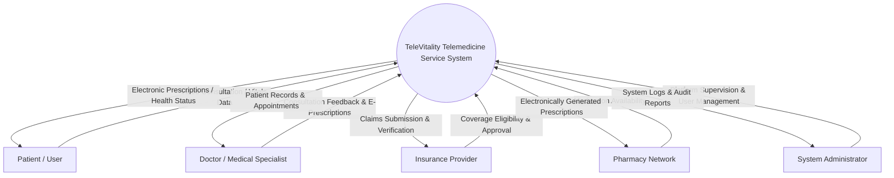
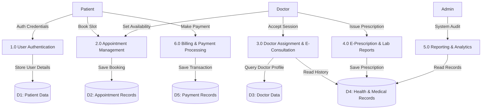
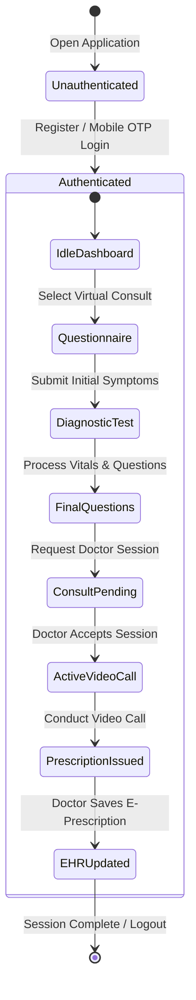
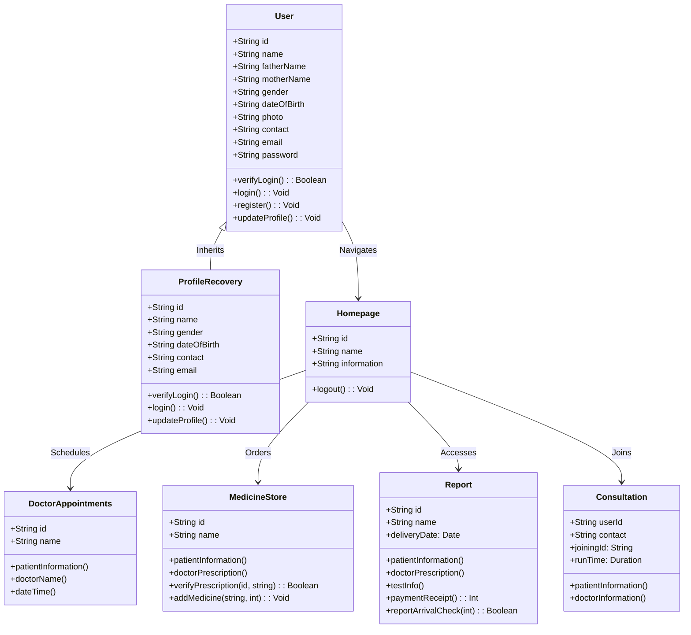
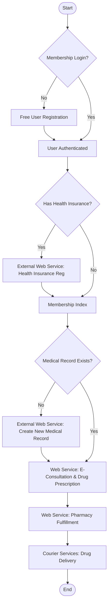
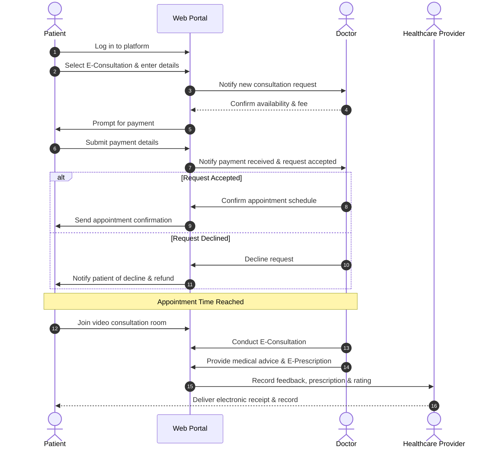
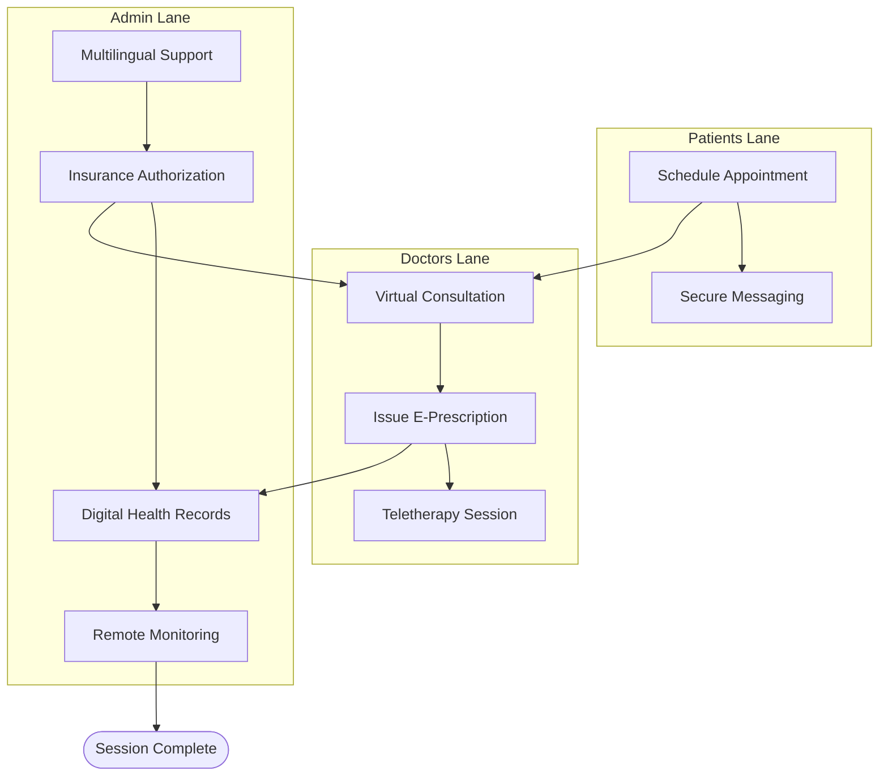
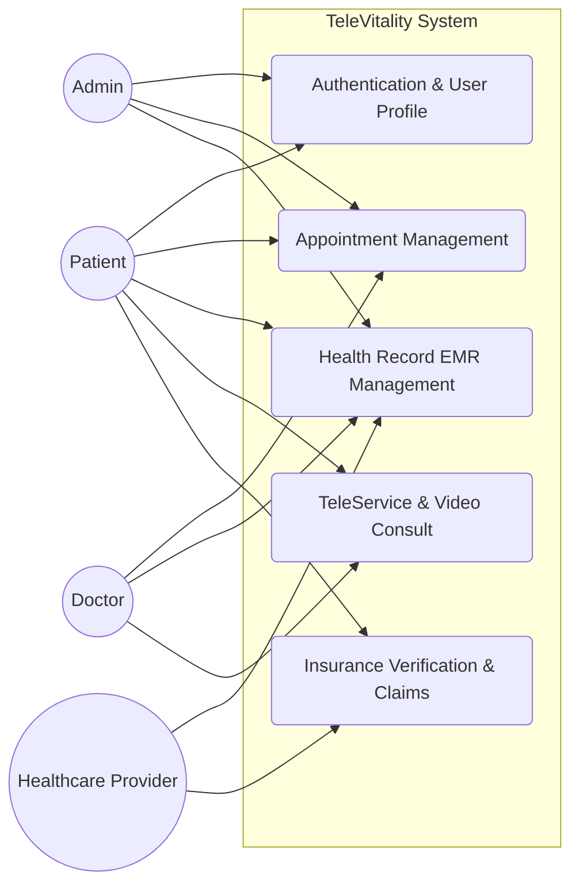
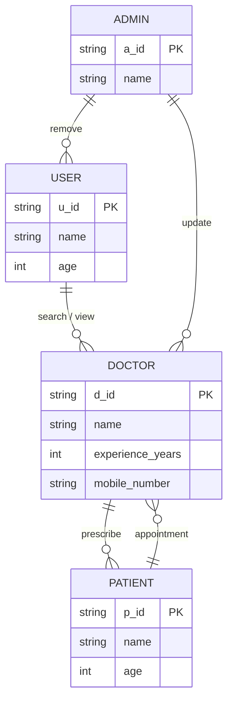
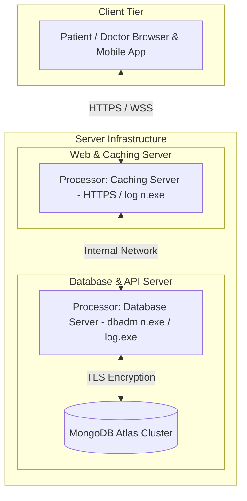

# TeleVitality - System Architecture & UML 2.5 Diagrams

> **Module**: 04  
> **Section**: Complete UML 2.5 System Specifications, Data Flow, Class Structure, ERD, and CRC Cards  
> **Original Document Reference**: [SRS_Doc.pdf](file:///home/nayem/Personal/SRS/SRS_Doc/SRS_Doc.pdf) (Pages 29–42)  

---

## 1. Architectural Overview

TeleVitality uses standard Unified Modeling Language (UML 2.5) specifications categorized into Structural, Behavioral, and Interaction models.

---

## 2. Context Diagram (Level 0 Overview)

The Context Diagram defines system boundaries and communication channels with external entities:



---

## 3. Data Flow Diagram (DFD Level 1)

Represents data movement, internal processing nodes, and data stores:



---

## 4. System State Diagram

Defines state transitions of a patient's session lifecycle:



---

## 5. Domain Class Diagram

Core object-oriented domain models, attributes, methods, and relationships:



---

## 6. Activity Diagram

Execution workflow for user authentication, insurance processing, and e-consultations:



---

## 7. Sequence Diagram (Doctor-Patient E-Consultation)

Detailed step-by-step interaction between actors and system controllers during consultation:



---

## 8. Swimlane Diagram

Multi-actor operational responsibility flow across System Roles:



---

## 9. Use Case Diagram & UC-01 Descriptive Form

### Use Case Diagram



### UC-01: TeleService Descriptive Specification Form

- **Use Case ID**: `UC-01`
- **Use Case Name**: TeleService - Online Consultation & E-Prescription
- **Primary Actor**: Patient
- **Stakeholders & Interests**:
  - *Patient*: Wants convenient online specialist consultations and instant digital prescriptions.
  - *Doctor*: Wants efficient remote vital tracking and structured consultation tools.
  - *Healthcare Provider*: Wants accurate billing and medical history tracking.
  - *Admin*: Wants high system uptime and security audit logging.
- **Preconditions**: Patient is authenticated via mobile OTP or password login.
- **Main Success Scenario**:
  1. Patient logs into TeleVitality portal.
  2. Patient selects doctor specialty and books appointment slot.
  3. Patient completes video consultation with assigned doctor.
  4. Doctor generates and electronically signs e-prescription.
  5. Patient receives prescription in profile EHR and options for pharmacy delivery.
  6. Session completes and receipt is archived.
- **Alternative Scenarios**:
  - *a) Login Failure*: System prompts OTP resend option.
  - *b) Insurance Rejection*: System displays eligibility error message and allows manual payment.

---

## 10. Class Responsibility Collaborator (CRC) Cards

```
+-------------------------------------------------------------------------+
| Class Name: User Authentication                                         |
+---------------------------------------------------+---------------------+
| Responsibilities                                  | Collaborators       |
+---------------------------------------------------+---------------------+
| • Process user registration & mobile OTP          | User, Admin         |
| • Verify credentials & issue JWT token            |                     |
+---------------------------------------------------+---------------------+

+-------------------------------------------------------------------------+
| Class Name: TeleService Engine                                          |
+---------------------------------------------------+---------------------+
| Responsibilities                                  | Collaborators       |
+---------------------------------------------------+---------------------+
| • Establish WebRTC video consultation streams     | Doctor, Patient     |
| • Handle secure messaging & chat logs             |                     |
+---------------------------------------------------+---------------------+

+-------------------------------------------------------------------------+
| Class Name: Health Record Management                                    |
+---------------------------------------------------+---------------------+
| Responsibilities                                  | Collaborators       |
+---------------------------------------------------+---------------------+
| • Store & retrieve electronic health records      | Patient, Doctor,    |
| • Archive e-prescriptions & diagnostic lab reports| Provider            |
+---------------------------------------------------+---------------------+
```

---

## 11. Entity-Relationship (ER) Diagram

Database relational schema entities, attributes, and cardinality:



---

## 12. Client-Server Deployment Diagram

Physical deployment infrastructure showing client nodes, caching servers, app servers, and database instances:


