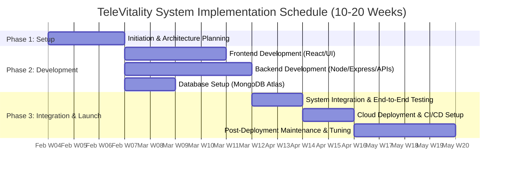

# TeleVitality - Tech Stack & Implementation Roadmap

> **Module**: 06  
> **Section**: System Architecture Tech Stack, Component Roles, Cloud Infrastructure & Gantt Rollout Schedule  
> **Original Document Reference**: [SRS_Doc.pdf](file:///home/nayem/Personal/SRS/SRS_Doc/SRS_Doc.pdf) (Pages 52–60)  
> **Live GanttPRO Dashboard**: [GanttPRO Schedule Link](https://app.ganttpro.com/shared/token/94ef6e4c0e712696077e3ed40f25763e0acc3645cc847ebb1a580e5ca843762d/1430582)  

---

## 1. System Technology Stack

TeleVitality is designed using a modern, scalable full-stack JavaScript architecture (MERN / Next.js) tailored for high-concurrency web apps and real-time medical data management:

```
┌─────────────────────────────────────────────────────────────────────────┐
│                        FRONTEND TIER (Client Layer)                     │
│  React.js / Next.js  │  React Router  │  Redux Toolkit  │  Axios / WebRTC│
└────────────────────────────────────┬────────────────────────────────────┘
                                     │ RESTful APIs / WebSockets
┌────────────────────────────────────▼────────────────────────────────────┐
│                        BACKEND TIER (Application Layer)                 │
│  Node.js Runtime  │  Express.js Framework  │  JWT Auth  │  Mongoose ODM   │
└────────────────────────────────────┬────────────────────────────────────┘
                                     │ TLS Encrypted Data Stream
┌────────────────────────────────────▼────────────────────────────────────┐
│                        DATABASE & CLOUD TIER (Data Layer)              │
│  MongoDB Atlas (Managed Cloud Cluster)  │  Cloud Object Storage (AWS S3) │
└─────────────────────────────────────────────────────────────────────────┘
```

### 1.1. Frontend Architecture
- **React.js / Next.js**: Component-based modular framework providing server-side rendering (SSR) for initial page loads and seamless client-side single-page app (SPA) performance.
- **React Router**: Client-side routing for seamless navigation between consultation search, health record portals, and insurance forms.
- **Redux Toolkit**: Centralized state management for application-wide states (user authentication tokens, active video call state, patient appointment cart, and EHR cache).
- **Axios**: Asynchronous HTTP client for communicating with backend REST endpoints, equipped with request/response interceptors for JWT auth headers.
- **Bootstrap / CSS Design Tokens**: Responsive layout grid and customized component styling for cross-device compatibility (desktop, tablet, mobile).

### 1.2. Backend Architecture
- **Node.js**: Asynchronous, non-blocking I/O JavaScript runtime optimized for handling high-concurrency real-time WebSocket signals and video room handshakes.
- **Express.js**: Lightweight web framework managing RESTful API routes, request middleware, parameter sanitization, and error handling.
- **JWT (JSON Web Tokens)**: Stateless token-based user authentication and role authorization middleware (RBAC).
- **Mongoose ODM**: Object Data Modeling library providing schema validation, type safety, and database hook triggers for MongoDB operations.

### 1.3. Database & Cloud Hosting
- **MongoDB Atlas**: Managed multi-region cloud database cluster offering automated sharding, automated index optimization, high availability replicas, and encrypted backups.
- **Static Hosting & CDN**: Vercel / Netlify for frontend distribution; AWS EC2 / Containerized Cloud Run for backend API scaling.

---

## 2. 7-Phase Deployment & Implementation Schedule

The implementation schedule spans an estimated duration of **10 to 20 weeks** divided into seven execution stages:



### Phase Breakdown

1. **Phase 1: Project Setup and Planning** *(Duration: 2–3 Weeks)*
   - Finalize software requirements, business rules, and API contracts.
   - Establish Git version control repository and workflow settings.
   - Design high-fidelity wireframes and Figma UI system.

2. **Phase 2: Frontend Development** *(Duration: 2–4 Weeks)*
   - Bootstrap React.js project repository with Router and Redux state tree.
   - Build responsive UI components for Doctor Directory, Appointment Booking, Patient Dashboard, and Insurance Form.
   - Integrate WebRTC media player for virtual video consultations.

3. **Phase 3: Backend Development** *(Duration: 3–5 Weeks)*
   - Configure Node.js / Express server infrastructure and routing modules.
   - Implement JWT authentication middleware and password hashing.
   - Construct RESTful controllers for User, Doctor, Appointment, Prescription, and Review entities.
   - Write unit tests for backend controllers.

4. **Phase 4: Database Provisioning** *(Duration: 1–2 Weeks)*
   - Provision MongoDB Atlas cloud cluster and configure IP access control.
   - Define Mongoose schemas with strict data types, defaults, and field validations.
   - Configure automated daily backup schedules.

5. **Phase 5: System Integration & End-to-End Testing** *(Duration: 1–2 Weeks)*
   - Connect React Axios services to live Express backend endpoints.
   - Perform end-to-end user testing (Registration -> Booking -> Video Consult -> E-Prescription -> Record Retrieval).
   - Conduct security penetration testing and HIPAA compliance checks.

6. **Phase 6: Production Deployment & CI/CD** *(Duration: 1–2 Weeks)*
   - Configure GitHub Actions CI/CD deployment pipelines.
   - Deploy backend API server to cloud host (AWS / Cloud Run) with SSL/TLS encryption.
   - Deploy frontend React app to static CDN hosting (Vercel / Netlify).

7. **Phase 7: Post-Deployment Maintenance** *(Ongoing)*
   - Monitor live system latency, error logs, and user feedback.
   - Perform routine database index optimization and security patch updates.

---

## 3. Future Roadmap & Innovation Opportunities

1. **AI-Powered Diagnostics**: Integrating machine learning algorithms for pre-consultation symptom analysis and automated medical triage.
2. **IoT Vital Device Bridges**: Direct Bluetooth API integration for wearable devices (Apple HealthKit, Google Health Connect) to auto-sync vitals.
3. **Pharmacy API Integration**: Direct electronic prescription transmission to commercial pharmacy fulfillment systems.
